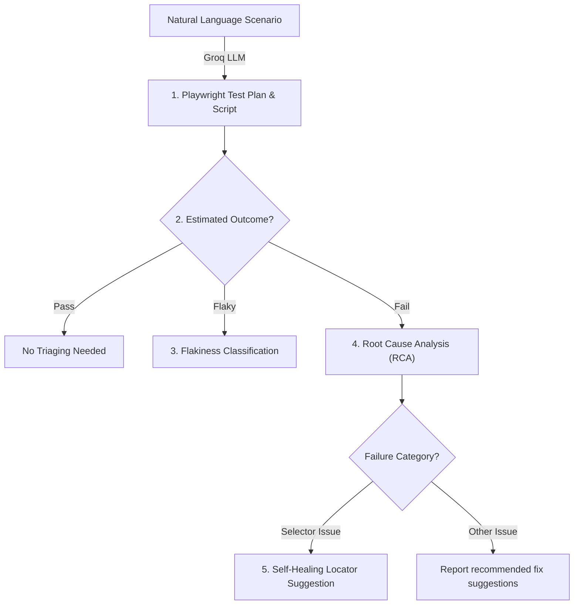

# AI UI Tester 🧪🤖

An intelligent, AI-powered UI and E2E test generation, analysis, and self-healing platform. The application provides an elegant, clean user interface (built in a premium light theme) for specifying testing scenarios in natural language, orchestrating the test runs, visualizing live logs, and reviewing deep AI analyses of bugs, root causes (RCA), and self-healing selector suggestions.

### 🌐 Live Demo
Visit the hosted application here: **[https://Piyush-Patole.github.io/AI.UITester/](https://Piyush-Patole.github.io/AI.UITester/)**

---

## 🌟 Key Features

### 1. ⚙️ Setup & Queue
- **Target Environment Config**: Easily define your target environment URL along with optional username and password credentials.
- **Natural Language Scenarios**: Type or paste one or multiple test scenarios in plain English (e.g., *"Verify the login form fails with invalid password and shows a red alert"*).
- **Interactive Queue**: Manage, review, and clear your testing queue before starting the batch processing. Includes browser selection (Chromium, Firefox, WebKit) and test type tags (Functional, Accessibility, Performance).

### 2. 🖥️ Execution Logs
- **Live Terminal Logs**: Watch test runs in real time using a centered developer console style with custom icons.
- **Progress Tracking**: Clear visual progress indicators showing the completion rate of the current test batch.
- **Smart Transitions**: The application automatically shifts navigation to the logs when a run begins.

### 3. 📊 Detailed Results Table
- **Full-Width Interactive Grid**: A fully-featured spreadsheet table using **AG Grid Community** to view detailed results:
  - **AI RCA (Root Cause Analysis)**: Issue title, description, reason, and recommended bug fixes.
  - **Locator Self-Healing**: Automatically suggested locators when existing DOM selectors break, including confidence scores.
  - **Flakiness Classification**: Analytics determining whether failures are due to genuine bugs or flaky tests.
- **Data Exporting**: One-click actions to copy the results to clipboard (TSV) or download them as CSV/Excel formats.

### 4. 📈 Analytics Dashboard
- **Executive Metrics**: High-level visual statistics including Total Tests, Pass Rate %, Passed, Failed, and Flaky counts.
- **Interactive Charts**:
  - **Execution Status**: Donut pie chart summarizing pass, fail, flaky, and unknown distributions.
  - **Failure Severity**: Bar chart classifying failures by severity (Critical, High, Medium, Low) to help triage bugs.

---

## 🧪 How UI Testing and Analysis Works

This platform acts as an **AI-driven QA engineer** that translates user requirements into executable test scripts and automatically performs bug triaging and test suite maintenance. It uses a **multi-stage LLM chain** powered by Groq to run the following process:

### Process Flowchart


### 1. Natural Language to Playwright Translation
- **Input**: The user enqueues testing scenarios written in plain English (e.g., *"User cannot submit the login form without filling in the password field"*).
- **Process**: The system calls Groq's LLM (`llama-3.3-70b-versatile` or `mixtral-8x7b-32768`) with scenario prompts.
- **Output**: The LLM outputs a structured JSON test plan containing sequential E2E steps (actions, target elements), assertions, and **actual, executable Playwright test scripts** written in TypeScript.

### 2. Intelligent Bug Triaging (RCA)
- **Process**: If a scenario has an estimated status of `Fail`, it triggers a **Root Cause Analysis (RCA)** stage.
- **Analysis**: The LLM analyzes the failure context and categorizes the bug:
  - **Application Bug**: A genuine issue on the target site (e.g., broken UI links, form validation failure, console error).
  - **Test Script Bug**: An outdated locator, timing issue, or script configuration error.
- **Output**: Generates a detailed bug explanation, severity rating, and recommended fix suggestions.

### 3. Self-Healing Locators
- **Problem**: Brittle DOM selectors (autogenerated IDs, dynamic class names) are the leading cause of broken automated test suites.
- **Process**: If the RCA stage identifies a `selector_issue` (broken element locator), the system captures the broken locator and the surrounding HTML context.
- **Healer**: It prompts the LLM to inspect the surrounding DOM structure and generate a **healed, robust selector** (e.g., using aria-roles, text anchors, or stable parent hierarchies instead of dynamic class names).
- **Output**: Returns a repaired locator along with an AI confidence rating.

### 4. Flakiness Classification
- **Process**: If a test is flagged as flaky, the system parses the execution run history.
- **Output**: The LLM calculates a flakiness probability score and classifies the run behavior to prevent false-negative alerts in the developer build pipelines.

---

## 🛠️ Technology Stack & Core Tools

- **Framework**: [React 19](https://react.dev/) + [TypeScript](https://www.typescriptlang.org/) + [Vite 8](https://vite.dev/) (For clean SPA structure and HMR)
- **AI Integrations**: [Groq API](https://groq.com/) using models like `llama-3.3-70b-versatile` (Powers test plan generation, RCA bug triaging, self-healing, and flakiness checks)
- **Simulated Test Automation**: [Playwright](https://playwright.dev/) (The target format for LLM generated E2E scripts)
- **UI Components & Icons**: [Material UI (MUI v9)](https://mui.com/material-ui/) + [Lucide React](https://lucide.dev/) (Renders the premium light theme cards, layout tabs, console terminal, and inputs)
- **Data Grid**: [AG Grid Community (v35)](https://www.ag-grid.com/) (Renders the full-width results sheet with sorting, filtering, and data exporters)
- **Charts**: [Recharts (v3)](https://recharts.org/) (Calculates and displays visual analytics donut and bar charts)
- **State Management**: [Zustand](https://github.com/pmndrs/zustand) (Maintains session credentials, active scenarios queue, and run results in memory)

---

## 📂 Project Structure

```bash
ai-ui-tester/
├── src/
│   ├── api/                 # Groq client configuration & services
│   ├── assets/              # Static assets & icons
│   ├── components/
│   │   ├── common/          # Global dialogs (API key setup)
│   │   ├── dashboard/       # Stat cards, Pie & Bar charts
│   │   ├── input/           # Credentials form, Queue list, text field inputs
│   │   ├── layout/          # AppShell, Header, & NavTabs navigation
│   │   ├── processing/      # Progress bars & monospace log console
│   │   └── results/         # Results grid tables & custom cell badges
│   ├── hooks/               # Batch processor, export tools, dashboard calculators
│   ├── prompts/             # System and user prompts for Groq LLM
│   ├── store/               # Zustand stores (scenario, session, result states)
│   ├── types/               # TypeScript type definitions
│   ├── utils/               # CSV/XLSX export utils & column definition builders
│   ├── theme.ts             # MUI theme mode, palette, and style overrides
│   ├── main.tsx             # Application mount entrypoint
│   └── index.css            # Global CSS overrides
├── package.json
├── tsconfig.json
└── vite.config.ts           # Vite build parameters & base subfolder settings
```

---

## 🚀 Getting Started

### 📋 Prerequisites
Ensure you have **Node.js** (v18 or higher) and a package manager (**npm**, **yarn**, or **pnpm**) installed.

### 📥 Installation
1. Clone the repository:
   ```bash
   git clone https://github.com/Piyush-Patole/AI.UITester.git
   cd AI.UITester/ai-ui-tester
   ```
2. Install the dependencies:
   ```bash
   npm install
   ```

### 💻 Running Locally
To launch the development server with Hot Module Replacement (HMR):
```bash
npm run dev
```
Open **[http://localhost:5173/](http://localhost:5173/)** in your browser.

---

## 🏗️ Production Build & Local Deployment

### Compile the Assets
To build a highly optimized production bundle:
```bash
npm run build
```
This generates the static files in the `/dist` directory.

### Deploying to GitHub Pages
Since the project is configured with a base path of `/AI.UITester/`, you can deploy it to GitHub Pages.

#### Deployment Script
A simple and clean script to publish the `/dist` bundle directly to your `gh-pages` branch:
```powershell
# 1. Build the production files
npm run build

# 2. Navigate to build output
cd dist

# 3. Push to gh-pages branch
git init
git checkout -B gh-pages
git add -A
git commit -m "deploy: release on GitHub Pages"
git remote add origin https://github.com/Piyush-Patole/AI.UITester.git
git push -f origin gh-pages
```

---

## 📄 License
This project is open-source and available under the [MIT License](LICENSE).
